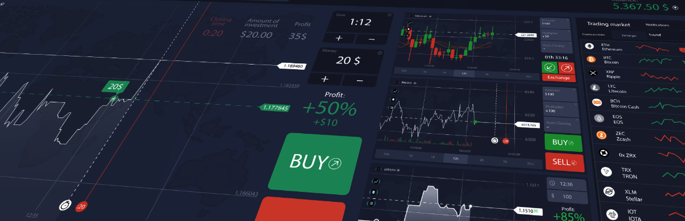
# Machine Learning Trading Bot
>Multiple supervised machine learning classifiers are used and tested; input features and parameters were adjusted in the analysis to enhance trading signals' accuracy and trading bot's ability to adapt to new data.

Analysis includes:

* [Establish a Baseline Performance](#establish-a-baseline-performance)

* [Tune the Baseline Trading Algorithm](#tune-the-baseline-trading-algorithm)

* [Optimize cumulative return](#optimize-cumulative-return-on-the-baseline-trading-algorithm)

* [Evaluate a New Machine Learning Classifier](#evaluate-a-new-machine-learning-classifier)

* [Create an Evaluation Report](#evaluation-report)
---

## Technologies
This project leverages python 3.7 with the following packages:

* [pandas](https://pandas.pydata.org/docs/getting_started/overview.html) - To read, calculate, analysis, visualize data

* [pathlib](https://docs.python.org/3/library/pathlib.html) - For providing paths of files and directories

* [matplotlib](https://matplotlib.org/) - Creating data visualization

* [numpy](https://numpy.org/) - Performing mathematical calculation

* [sklearn](https://scikit-learn.org/stable/) - Predictive data analysis
---

## Installation Guide

Before running the Jupyter notebook file, first, install the following dependencies in Terminal or Bash under the `dev` environment.

```python
  pip install pandas
  pip install matplotlib
  pip install -U scikit-learn
  pip install pathlib
  pip install numpy
```

---

## General Information
It is necessary to import all libraries and dependencies.
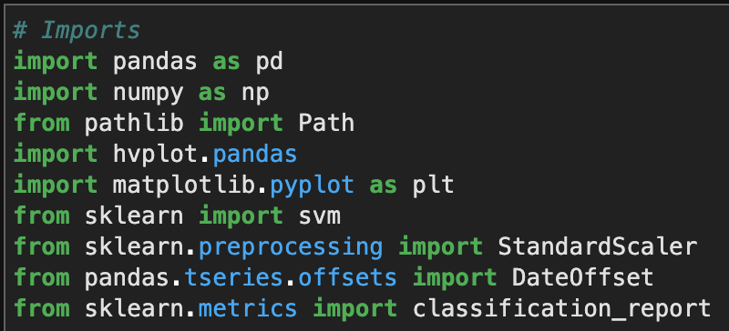
### Establish a Baseline Performance
-- After importing the original dataframe, calculate 'Actual Returns' based on closing price. 

```python
signals_df["Actual Returns"] = signals_df["close"].pct_change()
```
-- Generate trading signals using short- and long-window SMA values.

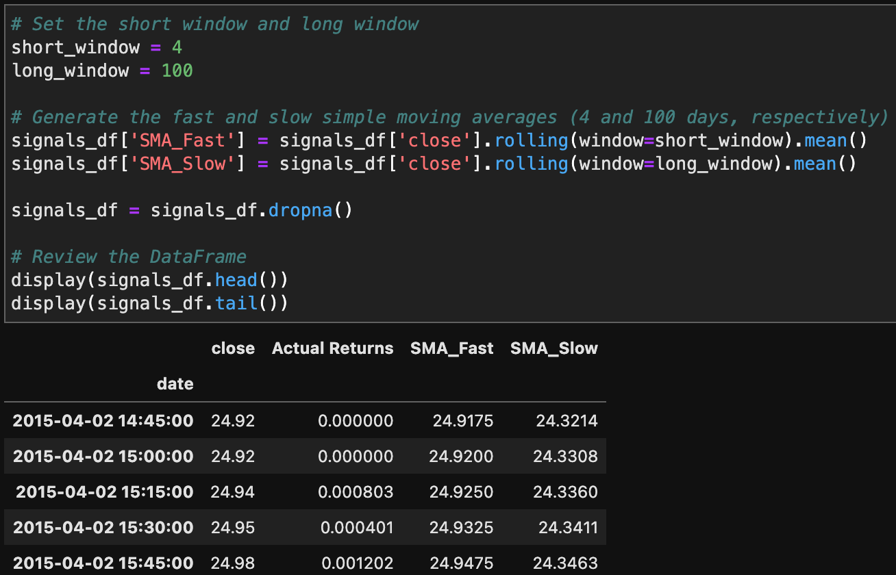

```python
signals_df['Signal'] = 0.0
signals_df.loc[(signals_df['Actual Returns'] >= 0), 'Signal'] = 1
signals_df.loc[(signals_df['Actual Returns'] < 0), 'Signal'] = -1
```

-- Calculate the strategy returns and plot the original strategy returns

```python
signals_df['Strategy Returns'] = signals_df['Actual Returns'] * signals_df['Signal'].shift()
```
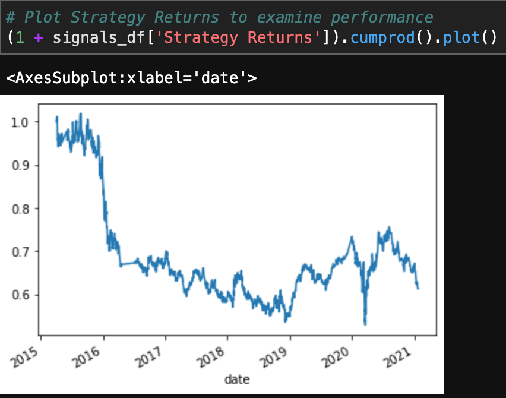

-- Feature data

```python
X = signals_df[['SMA_Fast', 'SMA_Slow']].shift().dropna()
y = signals_df['Signal']
```
-- Split data into training and testing datasets by dates

```python
training_begin = X.index.min()
training_end = X.index.min() + DateOffset(months=3)

X_train = X.loc[training_begin:training_end]
y_train = y.loc[training_begin:training_end]

X_test = X.loc[training_end+DateOffset(hours=1):]
y_test = y.loc[training_end+DateOffset(hours=1):]
```
-- Scale featured datasets
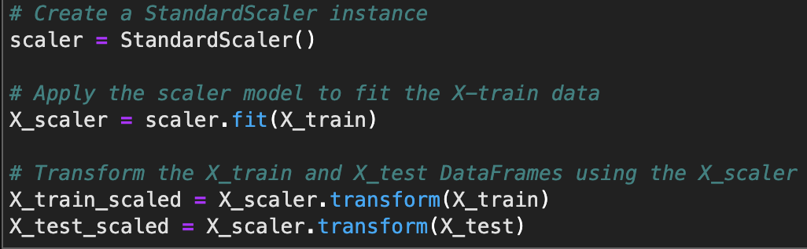

-- Use the SVC classifier model from SKLearn's support vector machine (SVM) learning method to fit the training data and make predictions based on the testing data

```python
svm_model = svm.SVC()
svm_model = svm_model.fit(X_train_scaled, y_train)
svm_pred = svm_model.predict(X_test_scaled)
```
-- Generate classification report with the SVC model predictions
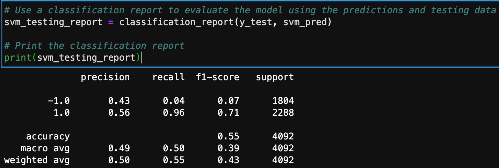

-- Create a predictions dataframe
```python
predictions_df = pd.DataFrame(index=X_test.index)
predictions_df['Predicted'] = svm_pred
predictions_df['Actual Returns'] = signals_df['Actual Returns']
predictions_df['Strategy Returns'] = predictions_df['Actual Returns'] * predictions_df['Predicted']
```
-- Plot the actual returns versus the strategy returns of the SVM model
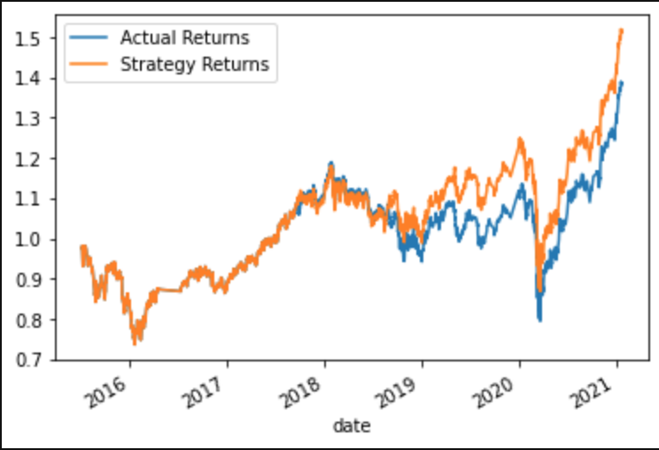

-- Conclusions about the performance of the `baseline trading algorithm`:

Based on the testing report and the SVM cumulative return plot, the SVM model performed well from the beginning of the period until mid 2018. That is when the actual and predicted returns start to be slightly differ. And the difference kept growing until the beginning of 2020, then it again drifted apart. The testing report indicates the model predicts well for buy signals with .96 recall rate, while it performed poorly predicting sell signals (.04 recall).

The SVM model made trading decisions that outperformed the actual returns in the scond half of the market data according to the plot. Overall, dispite the volatility, the SVM model's trading strategy produced a higher cumulative return value than the original.

### Tune the Baseline Trading Algorithm
-- Tune the training algorithm by adjusting the size of the training dataset
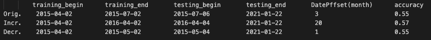

>***What impact resulted from increasing or decreasing the training window?***

By increasing testing dataset to 20 months, the prediction accuracy has improved to 0.57, especially the recall score for buying signal has increased to 1. Also the stragegy returns greatly out performed actual returns from the plot. By decreasing the training dataset to 1 month, the accuracy score has decreased. And the cumulative return brought by two strategies shows greater differences.

-- Tune the trading algorithm by adjusting the SMA input features.
  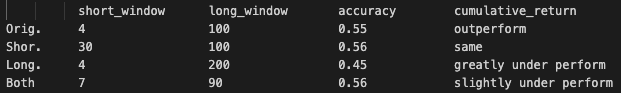        

>***What impact resulted from increasing or decreasing either or both of the SMA windows?***

As shown in the table above: when increasing the short window, the accuracy score increased slightly but the cumulative return shows the same. When increase the long window, the accuracy score decreased badly to 0.45 and the cumulative return delivered by bot was greatly under perform comparing to the original trading strategy. And lastly, when change both windows, the accuracy score appeared a subtle increase and the bot is slightly under perform to the original strategy.

### Optimize cumulative return on the baseline trading algorithm
-- Choose the set of parameters that best improved the trading algorithm returns

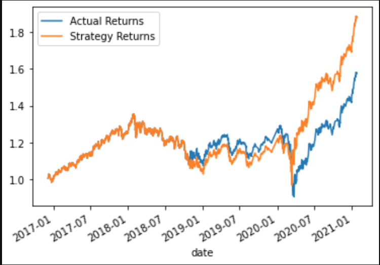

It shows that the current values of windows produce the highest cumulative return, yet by increasing the training dataset to 20 months, the machine learning algorith has delivered a cumulative return as high as 1.8, which is higher than modifying other parameters.

### Evaluate a new machine learning classifier
Use the original parameters that the starter code provided. But, apply to the performance of a second machine learning model.

-- Use classifier - AdaBoost
```python
from sklearn.ensemble import AdaBoostClassifier
abc = AdaBoostClassifier()
abc_model = abc.fit(X_train_scaled, y_train)
abc_pred = abc_model.predict(X_test_scaled)
abc_testing_report = classification_report(y_test, abc_pred)
```
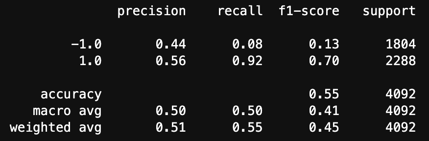 
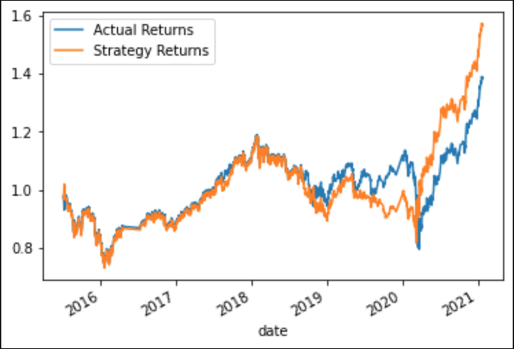 

-- Use classifier - DecisionTreeClassifier
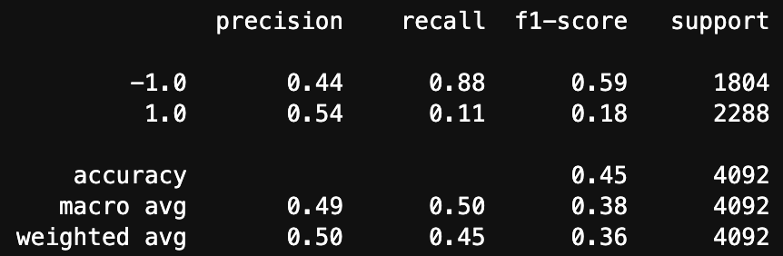 
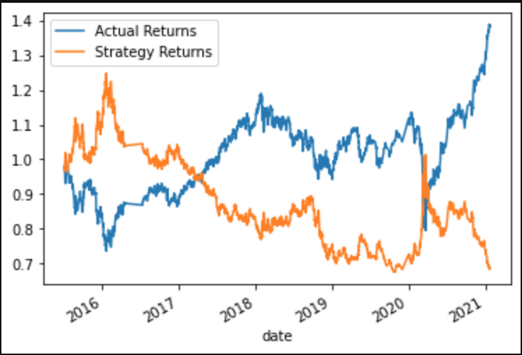

-- Use classifier - LogisticRegression
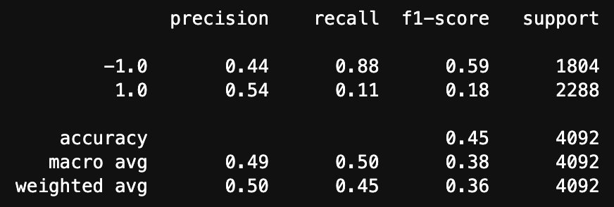 
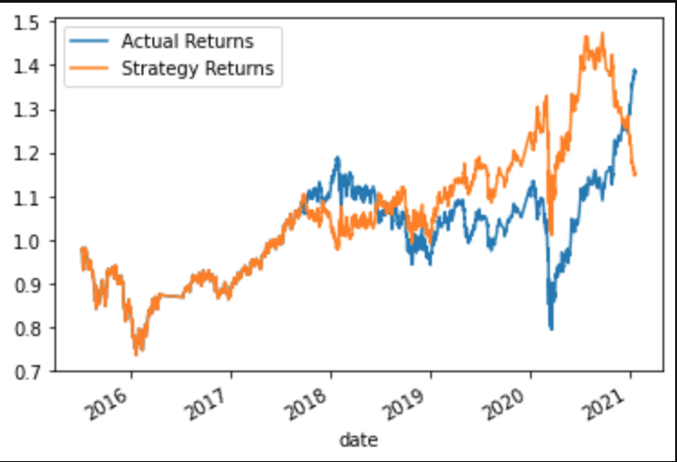


The best performing classifier among all three new machine learning classifier is the AdaBoostClassifier. 

>***Did this new model perform better or worse than the provided baseline model?***

The AdaBoost model performs slightly better than the SVM model because it delivers a higher cumulative return while the accuracy score remains unimproved from prior.

>***Did this new model perform better or worse than your tuned trading algorithm?***

The AdaBoost model performs slightly worse than the tuned SVM trading algorithm since the later returns a 1.8 cumulative return.

### Evaluation Report
In conclusion, 4 machine learning classifiers from SKlearn were used: support vector machine (SVM), AdaBoost, DecisionTreeClassifier, and LogisticRegression to enhance trading signals' accuracy as well as achieve optimal cumulative return.

During the SVM analysis, by adjusting training dataset size and altering long, short-window parameters, the accuracy score was improved by 0.01, cumulative return was elevated to 1.8 as shown below.

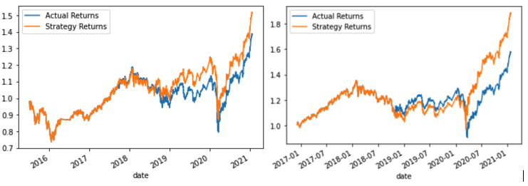 

Then, 3 new models were implemented using the original SVM parameters. The best performing classifier among all 3 were the AdaBoost Classifier. (Left to right: AdaBoost, DecisionTree, LogisticREgression)

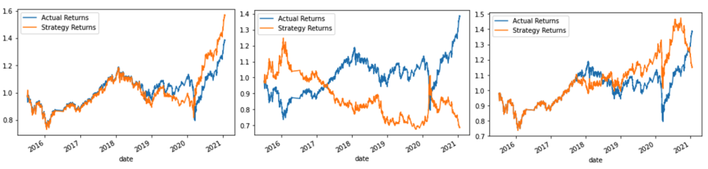

The preceeding image indicates, the AdaBoost Classifier performed better than the original SVM given the same parameters. But delivered a slightly worse return than the tuned SVM trading algorithm.

---

## Contributors

UC Berkeley Extension

Brought you by **Yanjun Lin Andrie**

* yanjun.lin.andrie@gmail.com

* https://www.linkedin.com/in/yanjun-linked

---

## License

MIT